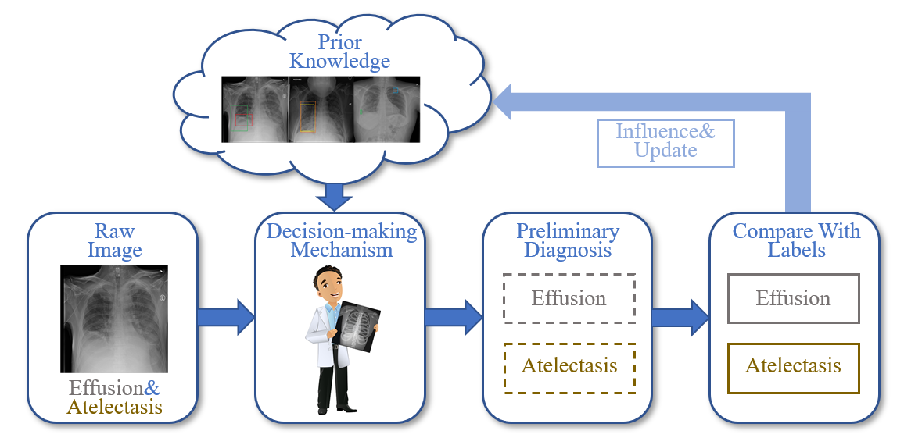

# MARL

# Introdunction
This is the official implementation of the paper ["Deep reinforcement learning framework for thoracic diseases classification via prior knowledge guidance"].
## Abstract

In this paper, we focus on the thorax disease diagnostic problem and propose a novel deep reinforcement learning framework, which introduces prior knowledge to direct the learning of diagnostic agents and the model parameters can also be continuously updated as the data increases, like a person's learning process. Finally, our approach's performance was demonstrated using the well-known NIH ChestX-ray 14 and CheXpert datasets, and we achieved competitive results.



# Quick start 

1. Clone this repo:
```sh
git clone 
cd MARL
```

2. Install [```cuda```](https://developer.nvidia.com/cuda-downloads), [```PyTorch``` and ```torchvision```](https://pytorch.org/).

Please make sure they are compatible.
We test our models on:
```sh
cuda==11, torch==1.9.0, torchvision==0.10.0, python==3.7.3
```

3. Data preparation.

Download [NIH](https://nihcc.app.box.com/v/ChestXray-NIHCC/folder/36938765345).
Download [CheXpert](https://stanfordmlgroup.github.io/competitions/chexpert/).

4. Train the model.
```sh
python main.py \
--dataset_dir '/path/to/data/' \
--batch-size 64 --print-freq 100 \
--output "path/to/output" \
--world-size 1 --rank 0 --dist-url tcp://127.0.0.1:3717 \
--gamma_pos 0 --gamma_neg 2 --dtgfl \
--lr 1e-4 --optim AdamW --pretrained \
--num_class 14 --img_size 224 --weight-decay 1e-2 \
```
